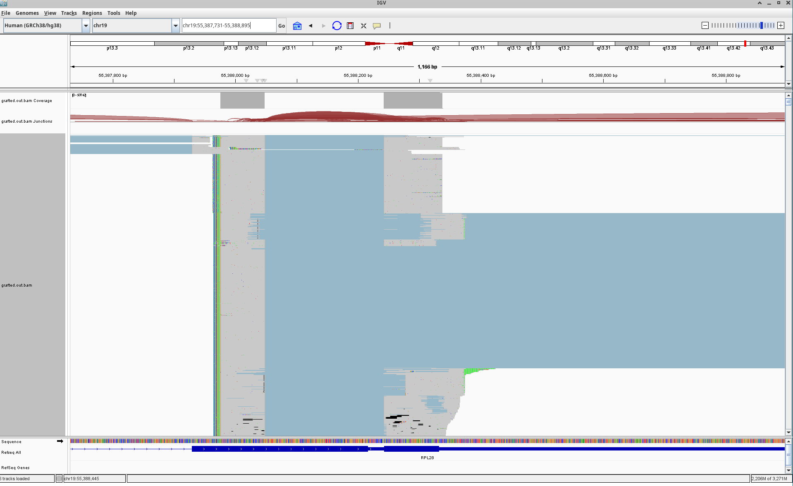

# Aim and disclaimer

This set of reports aims to explore, quantify and troubleshoot several aspects of our technique:

1. The abundance of offtargets (<0.5% ontargets for `mixing` [v2](https://www.biorxiv.org/content/10.1101/2024.05.18.594120v2.full))
   1. What are the enhanced/targeted (perhaps offtargeted) reads features? e.g. roi- rock- tso- other- motif-wise
   2. Is there any association to primer/capture features? (e.g. GC content effects)
2. The generation of chimeric reads with misprimed `roi` primers (`mixing`, `leukemia`, `pdgfra`)
   1. Quantification, description of the problem
   2. If a problem, the discrimination between fusion reads and chimeric reads (`leukemia`)
   3. Association to other features (local motifs, GC content etc)
   4. Impact in cancer applications where the ROI primer is very close to the breakpoint, e.g. some BCR/ABL profiling experiments
   
These thoughts are written by Izaskun Mallona (izaskun.mallona@mls.uzh.ch) **only**.

I believe our experimental design offers the necessary flexibility to explore these features and possible caveats. Namely:
- `mixing`. Normally processed, e.g. evaluating _only_ unique mappers or raw reads, provides rock, roi, and unmod roi (in WTA) experiments, helping 1.1, 1.2, 1.3, 2.2
- `pdgfra`. Validation set for `mixing` with a single reference genome; low capture efficiency if I recall correctly
- `leukemia`. Cell lines have associated known truths (fusions to be detected) and one of the roi primers (major) is easy to tell apart from chimeras due to its placement away from the breakpoint. Not so for other roi primers.

We have preliminary data describing aspects of these two major concerns but have not formalized them into a single report nor manuscript section.

# Design

We plan our checks to be:

- Molecular biology-driven (hypothesis-driven). Not hypothesis-free nor exploratory. Wet lab protocols and data properties are linked, and we can intuitively expect some challenges and data properties from the former.
- Topdown analysis on downsampled data and self-contained, so not linked to other PRs (e.g. leukemia, nor leukemia_patient)
- From GEO data, whenever possible - not relying on other analysis.

# 2.1 Quantification of ROI potential artifacts

## Naming

rock, ROCK, RoCK etc mean both technique and capture sequence; same for ROI, roi etc. (roi|rock)`m` highlights sequence _motifs_ are being discussed, e.g. sequences present within reads. 

## Molecular biology

- `rock` allows capturing mRNAs by sequence similarity. It acts as a replacement of oligodTs (which capture polyA transcript).
  - We hardly see the `rockm` (rock motifs) within reads because they typically downstream of it; for short reads, we do not reach it. We have longer sequencing results for `leukemia` though.
- `roi` is as primer replacing random hexamers. Sequencing reads start with the `roi` sequence in their 5'. `roi` primers show high sequence similarity to some region of the targets. They are 5' of the `rock` capture (if present) or of the polyA (if `rock` is not present)
  - We use *very short* `roi` primers and low annealing temperature; hence, `roi` priming is expected to be unspecific. This is a feature, not a bug. But it generates offtargets, more precisely chimeric reads.
  - If true, a sizeable portion of the TSO and WTA reads should contain `roi` sequences at the read start, if running `roi`. Not if running `rock` alone.
  - If true, nonspecific priming events can result in `roi`-`cdna` chimeric reads where the `roi` sequence was not expected to be 5' of the (unspecific) cDNA sequence
  - If true, specific priming events will result in `roi`-`cdna` reads where the `roi` sequence is the oligo sequence (it is not cDNA, but a primer), even if the genome/transcriptome has variants on it
  - To check this:
    - We can make use of the unmodified experiments as well as `rockroi` and `wta roi` (no rock) experiments.
    - We can make use of the leukemia experiments where read lengths are long enough as to sequence both `rock` and `roi` parts within single reads
       - So we can build expected read conformations (= true read fusions vs chimeric reads; akin to simulations)
          - And, if these read conformations are different, we can quantify them separately (goes to aim 2.2) 

## Read conformations

Schemas depicting expected ontarget and offtarget read conformations, per experiment and perceived challenges:

- "|" means nucleotide identity
- "*" means mismatch
- `R` depicts a ROIm nucleotide. Mind these are very short!
- `C` depicts a RoCKm nucleotide. Mind these are longer.

### Random primed polyA

Sequencing errors aside, cDNA read and mRNA are identical

```
-------------------------------AAAAA mRNA (not seen)
||||||||||||||||||||||               identity
----------------------               cDNA read
```

### ROI primed polyA ontarget

3' of the read is cDNA; 5' is the ROI primer. Requirements: distance between ROIm (ROI motif) and polyA is short; seq variation in ROIs (ROI sequence) is only technical.

```
RRR----------------------------AAAAA mRNA (not seen)
||||||||||||||||||||||               identity
RRR-------------------               cDNA read
```

### ROI primed polyA chimeric

The 5' of the read is congruent with a ROIs but the mRNA does not have a ROIm; the read is hence chimeric and alignable with softclipping.

```
-------------------------------AAAAA mRNA (not seen)
***|||||||||||||||||||               identity
RRR------------------$               cDNA read
```

### Random primed rock

Unless sequenced long enought the ROCKm (rock motif) is not present in the read.

```
----------------------------CCCCC----- mRNA (not seen)
||||||||||||||||||||||                 identity
----------------------                 cDNA read
```

### ROI primed rock ontarget

Unless sequenced long enough the ROCKm (rock motif) is not present in the read.

```
RRR-------------------------CCCCC----- mRNA (not seen)
||||||||||||||||||||||                 identity
RRR-------------------                 cDNA read
```

### ROI primed rock offtarget

Not sure why is it captured; due to the TSO? pure WTA abundance? Worth checking distance to polyA? 

```
RRR----------------------------------- mRNA (not seen)
||||||||||||||||||||||                 identity
RRR-------------------                 cDNA read
```

### ROI primed rock offtarget chimeric

Neither the ROCKm nor ROIm are present in the mRNA. Alignable with softclipping aligners.

```
-------------------------------------- mRNA (not seen)
***|||||||||||||||||||                 identity
RRR-------------------                 cDNA read
```

### Challenge: fused transcripts vs chimeric reads

Lets imagine a gene `B` and gene `A` which are fused into `BA`.

```
--------------------------------------   B mRNA (not seen)
        ||||||||||||******************   B vs BA identity
        ------------------------------   BA fused mRNA (not seen)
              ******||||||||||||||||||   BA vs A identity
              ------------------------   A mRNA (not seen)
```

This can be approached by designing `rock` rather downstream of `A` and `roi` upstream of the breakpoint and in `B`. Hence capturing `B` unfused and `BA` fused, but guiding the reads to the fused `BA` (via `roi`).

```
--------------------------------CCCC--   B mRNA (not seen)
        ||||||||||||******************   B vs BA identity
        ------------------------------   BA fused mRNA (not seen)
              ******||||||||||||||||||   BA vs A identity
              RRRR--------------------   A mRNA (not seen)
```

So the read conformation is :

```
        <----B-----><----A----------->   unfused B and A origins
               -->  <--                  tolerance
        ------RRRR--------------CCCC--   BA fused mRNA (not seen)
              |||||||||||||||            identity
              RRRR-----------            cDNA read
```

Problem is, the tolerance region between the 3' of the roim and the fusion point length **matters**: this region allows to distinguish fusions from ROI chimeras.

Tolerance calculation: sequence long enough so the `rockm` capture is also part of the read, so true cDNAs and chimeras can be told apart:

- True fusions contain the expected BA slice starting with `roim` and ending with (part of) `rockm`
- Chimeras are shaped as `rockm` : slice of `A` of length (read_length - roi_length) upstream of the rockm start position. With potential variants, including insertions and deletions. Chimeric sequence and insertions and deletions depend on the (unfused) `A` isoforms expressed and (perhaps) their expression level.

```
        <----B-----><----A----------->   unfused B and A origins
               -->  <--                  tolerance
        ------RRRR--------------CCCC--   BA fused mRNA (not seen)
              ||||||||||||||||||||       identity
              RRRR--------------CC       cDNA read (true fusion)
              RRRR**||||||||||||CC       expected chimera
```

An alternative view, BA fused transcripts could be:
- oligodT, randomly primed. Unstacked reads, perhaps showing the fusion (unlikely, 3' bias)
- oligodT, roi. Stacked reads, unlikely due to distance between oligodT and roi
- rock, roi. Stacked reads, read starts at roi seq and goes over the breakpoint and `A` until read length
- chimeras

To explore these, diagnostic aspects are: roim presence; variants within the tolerance region; abundances as compared to other background artifacts, e.g.

- ROI:B quantities
- ROI:anything chimeras

As extra datasets and validations, we will reanalyze:

- Truths where the ROI primer is >20 nt away from the fusion point

## Quantification

First, we run simple ROI scans on raw reads as follows:

### Experimental design (leukemia)


Slide from Giulia Moro.

### Truths, experimental metadata

Cell lines:

|   Cell line       | Fusion   | ROIs  |
| :---------------- | :------: | ----: |
| a                 |   b      | c     |

# Analysis

## Reusable capabilities

### `extract_and_quantify_roi_reads` ROIm quantifier

Script with signature `extract_and_quantify_roi_reads --roi regex --cdna cdna.fastq.gz --cb cbumi.fastq.gz --output annotated.fastq.gz`

1. Decorates cDNA and fastqs with UMI and CB (from R1) and whether WTA or TSO (by adding these information to the read id)
2. Quantifies and writes fastq records containing the roi pattern(s) to the output file

Applications:
- To all experiments, downsampled. Why? To report the ROI rates.

Modifications:
- Perhaps add a 'trim' function to remove the ROI part to facilitate downstream analysis

### `align_roi_reads`

Aligns and counts `extract_and_quantify_roi_reads` outputs, perhaps with the `trim` function, to the relevant genome/transcriptome. Signature `align_roi_reads --fastq annotated.fastq.gz --genome x`.

Applications:
- First crack at quantifying offtarget/chimeras.
- All experiments, downsampled

## Sequential plan

1. Describe and quantify roim reads (rates, alignment, offtarget description)
  - Rule out, or acknowledge, chimeric rates  
  - For offtargets, couple ROI peak-calling capabilities to roim (and rockm and tsom) motif scans; evaluate colocalization
  - For on- and offtargets, compare TSO abundances to nonROI WTA abundances and with total TSO abundances (expectations)
2. For fusion experiments:
  - Download/buid a leukemia fusion database, while keeping also unfused WTs 
  - ePCR based on roi primers
  - Derive expected chimeric structures 
  - Quantify these (separately if possible)
  - For roim and/or chimeric reads:
    - report abudances by using the nonROI part of the read, e.g. BCR:mitoc, BCR:ribos, BCR:others, BCR:ABL we detected
    - if a clear expectation based in WTA expression levels was found in (1): calculate deviation from expectations for BCR:ABL, relying on the major fusion as yardstick

# Results (v0.1.0)

As in https://github.com/imallona/rock_roi_debug/releases/tag/0.1.0 .

## Analysis layout and aims

Note: _Chimeric read_ stands for ROI-containing reads. They could well be fusion reads and not technical chimeras.

1. Chimeric read count  
   - A low number of chimeric reads is acceptable and not inherently problematic.

2. Alignment of chimeric reads to genome or transcriptome using STAR (splicing-aware)
   - Aligned chimeric reads may be annotated as `BCR::X`, where `X` is the fusion partner.
   - Multiple fusion targets per cell can appear (e.g. `BCR::MALAT1`, `BCR::ACT`), though only two BCR loci are present in diploid cells. This is a diagnostic step.
   - Major `BCR::ABL1` fusions may be missed due to ambiguous alignment; STAR cannot disambiguate between `BCR` and `ABL1`. This is a diagnostic step.

3. Alignment of chimeric reads to curated fusion database using STAR (modified, splicing-unaware)
   - Chimeric reads matching the database's `BCR::ABL` records suggest known, citable fusions.
   - Chimeric reads matching other fusions, e.g. `X::Y`, are by definition `BCR::X::Y` and may reflect very novel biology or chimeric artifacts. This is a diagnostic step.
   - Reads aligning to both genome/txome and fusion database may indicate minor `BCR::ABL1` fusions. Because STAR can softclip the left side when aligning to the genome/txome `ABL1`.
   - Reads aligning only to genome/txome, not to fusion database, are likely chimeras, or novel `BCR::ABL1` fusions not reported by the fusion database.

4. General fusion detection (for all reads)  
   - Any read aligning to the fusion database supports potential fusion, regardless of being marked as chimeric. This is a control.

5. Cell-type specificity of chimeric reads 
   - Use fusion ground truth in cell lines (e.g. major/minor `BCR::ABL1`) for performance assessment.  
   - Consider whether baseline expression levels of fusion partners (e.g. `ABL1`) influence detection.

### Code

Largely undocumented and developed in three days. See the worfklow [07_flow.sh](https://github.com/imallona/rock_roi_debug/blob/main/07_flow.sh) and two dependencies: [the BAM grafter](https://github.com/imallona/rock_roi_debug/blob/main/07_flow/trimmed_start_bam_grafter.py) and [the R stuff](https://github.com/imallona/rock_roi_debug/blob/main/07_flow/plot_chimeras_on_umaps.Rmd).

## Wet lab experiment layout

By Giulia Moro


# How many chimeric reads are there?

We processed 465 million paired-end reads from the leukemia cell line experiment. We run a very strict scan of reads *starting* with canonical ROI primers. The majority of read pairs (99.3%) do not start with ROI primers. Consequently, just over 3 million read pairs (0.7%) were kept for further analysis. (Scans can be relaxed to detect way more chimeric reads, this report is rather strict/hard in filtering.)

The adapter with the highest trimming activity was roi_bcr_e13, a 12-nucleotide anchored 5′ adapter sequence (ACCATCAATAAG) that was successfully matched and trimmed more than 2.2 million times. 

Most successful matches were exact or near-exact 12-mer hits.

### Stats

#### roi_bcr_e13

**Sequence:** ACCATCAATAAG (length 12)

| Length | Count   | Expect | Max Err | Err 0    | Err 1   | Err 2   |
|--------|---------|--------|---------|----------|---------|---------|
| 10     | 26054   | 443.7  | 2       | 0        | 0       | 26054   |
| 11     | 81794   | 110.9  | 2       | 0        | 27915   | 53879   |
| 12     | 2053681 | 27.7   | 2       | 1874580  | 100143  | 78958   |
| 13     | 48111   | 27.7   | 2       | 0        | 17514   | 30597   |
| 14     | 16132   | 27.7   | 2       | 0        | 708     | 15424   |


#### roi_bcr_e14  

**Sequence:** ATTTAAGCAGAG (length 12)

| Length | Count  | Expect | Max Err | Err 0 | Err 1 | Err 2 |
|--------|--------|--------|---------|-------|-------|--------|
| 10     | 6115   | 443.7  | 2       | 0     | 0     | 6115   |
| 11     | 36223  | 110.9  | 2       | 0     | 1268  | 34955  |
| 12     | 24225  | 27.7   | 2       | 32    | 1238  | 22955  |
| 13     | 11488  | 27.7   | 2       | 0     | 384   | 11104  |
| 14     | 2157   | 27.7   | 2       | 0     | 0     | 2157   |


####  roi_bcr_e1  

**Sequence:** CCTTCCATGGAG (length 12)

| Length | Count   | Expect | Max Err | Err 0   | Err 1  | Err 2  |
|--------|---------|--------|---------|---------|--------|--------|
| 10     | 10521   | 443.7  | 2       | 0       | 0      | 10521  |
| 11     | 102562  | 110.9  | 2       | 0       | 53170  | 49392  |
| 12     | 597817  | 27.7   | 2       | 483363  | 44792  | 69662  |
| 13     | 28532   | 27.7   | 2       | 0       | 7120   | 21412  |
| 14     | 9227    | 27.7   | 2       | 0       | 1      | 9226   |


### Examples

First 28 records. Read ids are decorated for other purposes.

```
@A01251:735:HLLJLDRX3:1:2101:3143:1047_WTA_TAGCTTGTAGTGAAAACTGCGCGACATCTCACGGAGACGCTCG
accatcaataagGGGGAAGATTTCGTGAAGACCCTGAAGTGAGCCGCTGTGACGGGTGGCCAGTTTCCTTAATTTATGAAGGCATCATGTCACTGCAAAGCCGTTGCAGATAAACTTTGTATTTTAATTTGCTTTGGTGATGATTACTGTATTGACATCATCATGCCTTCCAAATTGTGG
+
FFFFFFFFFFFFFFFFFFFFFFFFFFFFFFFFFFFFFFFFFFFFFFFFFFFFFFFFFFFFF:FFFFFFFFFFFFFFFFFFFFFFFFFFFFFFFFFFFFFF:FFFFFFFFFFFFFFFFFFFFFFF:FFFFFFFFFFFFFFFFFFFFFFFFFFF:F:FFFFFFFF:FFFFFFFFFFFFFFFF
@A01251:735:HLLJLDRX3:1:2101:3432:1047_WTA_ACACACAAAGTGAGACCTTAGAGACAACAGGCTCCCCTGGAGC
accatcaataagTACAAACTGATGATAAATCAGTATTGGAAAGGATATGTAACTCTGAATACTCTTTTGACTATATATGTGTCAGCCATCAGCACTCTACTTATTCATAGAAGATTCAGTTAACTGTTTTAAGTAAATGATAAAAAAAGAAAAAAAAAAAAAAAAAAAAAAAAAACAAAA
+
FFFFFFFF:FFFFFFFF:FFFFFFFFFFFFFFFFFFFFFFFFFFFFFFFFFFFFFFFFFFFFFFFFFFFFFFFFFFFFFFFFFFFFFFFFFFFFFFFFFFFFFFFFFFFFFFFF:FFFFFFFFFFFFFFFFFFFFFFFFFFFF:FFFFFFFFF:FFF:FFFFFFFF:FFF,FF::,FF,,
@A01251:735:HLLJLDRX3:1:2101:6036:1047_TSO_ANACACGAAAATGAGCTGCCGTCCACAGTTGTTCTTAAGTGAC
agcatcaataagCCCTCTGAAGGCAAAGCGGCAAACCCCAAAATGGTGAGCAGTCTCCCCAGCACCGCCGACCCCTCTCACCAGACCATGCCGGCCAACAAGCAGAATGGATCTTCTAACCAAAGACGGAGATTTAATCCCCAGTATCATAACAACAGGCTAAATGGGCCTGCCAAGTCG
+
:,FFFF:FFFF,FF:::F::F:,:F:FFFF:FFF::FFF,FFF::FFFFFF,FFFFFFFFFFFFFFF::FFF::FFFFFF::F:F:F,F:F:F:F:,FFFFFF:F,F,FFF:FFFFF,:FFF:FFFF:F:FFF:FF:FFF,:FFF,F:,FF,F,,F:F:FFF:F,FFFFFFFFFFFFFFF
@A01251:735:HLLJLDRX3:1:2101:8766:1047_WTA_TCGAAGTGAGTGATGTGAAGAAGACATGCATAGTACTCTCTCT
ccttccatggagGGTGTAGAAGAGAAGAAGAAGGAGGTTCCTGCTGTGCCAGAAACCCTTAAGAAAAAGCGAAGGAATTTCGCAGAGCTGAAGATCAAGCGCCTGAGAAAGAAGTTTGCCCAAAAGATGCTTCGAAAGGCAAGGAGGAAGCTTATCTATGAAAAAGCAAAGCACTATCAC
+
FFFFFFFFFFFFFFFFFFFFFFFFFFFFFFFFFFFFFFFFFFFFFFFFFFFFFFFFFFFF:FFFFFFFFFFFFFFFFFFFFFFFFFFFFFFFFFFFFFFFFFFFFFFF,FFFF:FFFFFFFFFFFFFFFFFFFFFFFFFFFFFFFFFF:FFFFFFFF:FFFFFFFFFFF::FFFF,FFFF
@A01251:735:HLLJLDRX3:1:2101:13105:1047_WTA_ATCAGAGCTGTGAGGAATGATAGACAGAACGACAAAGCGCCAC
ccttccatggagTGTCTTGGCTATTCTTAGCCAACTGTTCCTCCATATTACTTCTAGAATTAGACCAACAATTTATAAATCAAACAAACCCAAGAGCATTGAAATTTTGATTGGATTTGTATTGAATTTATAGATTAATCTGGTAAACCATGTCATCTTTACAATGTTGTCTTCCAATAC
+
FFFFFFFFFFFFFFFFFFFFFFFFFFFFFFFFFFFFFFFFFFFFFFFFFFFFFFFFFFFFFFFFFFFFFFFFFFFFFFFFFFFFFFFFFFFF:FFFFFFFFFFFFFFFFFFFFFFFFFFFFFFF:FFFFFFF,FFFFFFFFFFFFF:F:::FFF:F:FFFFFFFFFFFFF:FFF,F:FF:
@A01251:735:HLLJLDRX3:1:2101:14335:1047_TSO_ANCGGATAGAATGAACCAAAGTCCACTCCTCAATAGTATCTCC
atttaacaagGTCCTGGTTTCTCTTGCAACACAGTAGCTAAACTTGCCTGCTTTTATATGCATTTTTGTAGGGATCAGCTTGGTAGACAGTATTAGCGGAGAAACACCTTGATCTTGGTTTGCAAGCCCTTCTCCCATCAGTCCTAGATTAGGCCCTGTTCAGCCATACCTACTACGCAT
+
FFFFFFFFFFFFFFFFFFFFFFFFFFFFFFFFFFFFFFFFFFFFFFFFFFFFFFFFFFFFFFFFF:FFFFFFFFFFFFFFFFFFFFFFFFFFFFFFFFFFFFFFFFFFFFFFFFFFFFFFFFFFFFFFFFFF:FFFFFFFFFFFFFFFFFFFFFFFFFFFFFFFFFFFFFFFFFFFFFFF
@A01251:735:HLLJLDRX3:1:2101:23176:1047_WTA_ACCCTGACCGTGATTGGTATGAGACAAGCCTGTTTGAGTATTC
accatcaataagGCATATTCAGTAGCTAAACTAGTACTAAAAATCATACAAGATTATCATAATCCAAAAAAATCTGTAGAGTACGGAAACTGCTGAAAAAAAAAAAAAAAAAAAAAAAAAAAAAAAAAAAAAGATTTTTAAAAAAAAAAAAAGGGAAAGGTTTAAAGAAGGTAAGAGGGG
+
FFFFFFFFFFFFFFFFFFFFFFFFFFFFFFFFFFFFFFFFFFFFFFFFFFFFFFFFFFFFFFFFFFFFFFFFFFFFFFFFFFFFFFFFFFFFFFFFFFFFFFFFFFFFFFFFFFFFFFFFF:,FF,FFFF,:,,,F:F::,FF,FFFFFFFF,,:,,,::,F,,:,,,,,:,F,:,,,,,

```

File available at `EDITED`.


## Do chimeras align to the human genome with a splicing-aware aligner (STAR)?

Please turn soft-clipping browsing on. On IGV, `View -> Preferences -> Alignments -> Show soft-clipped bases`. Also, you might want `View -> Preferences -> Alignments > (untick) Downsample reads`.
                        
This is GRCh38.

BAM file available at `EDITED`. Do not use the `Aligned.out.bam` within the same path.

Chimeric reads, that is, those starting with ROI primers, are alignable to GRCh38. About 76% of reads aligned uniquely, with ~1.1 million splice junctions detected—mostly canonical GT/AG. Only 3.9% of reads mapped to multiple loci. Error rates were low (mismatches at 0.83%, insertions and deletions ≤0.02%), and no chimeric reads were reported.

### Stats

Chimeric Reads Alignment to GRCh38 Genome/Transcriptome

| Category                 | Count     |
|--------------------------|-----------|
| Input Reads              | 2,855,631 |
| Uniquely Mapped Reads    | 2,179,317 |
| Multi-Mapped Reads       |   112,140 |
| Too Short (Unmapped)     |   563,252 |
| Splice Junctions (Total) | 1,112,400 |
| GT/AG Splices            | 1,081,727 |


### Examples

##### chr9:130,853,981-130,854,306 ABL1 

Minor BCR::ABL1 or perhaps chimeric ABL1 (as it aligns directly to the transcriptome)

<p align="center">
  
</p>

### chr1:42,701,928-42,702,220  YBX1 ENSG00000065978

A typical chimeric ROI peak

<p align="center">
  
</p>


### chr19:55,387,731-55,388,895 RPL28 ENSG00000108107 

A spliced example

<p align="center">
  
</p>


### chr11:65,499,305-65,499,622 MALAT1

Multiple different chimeras in close proximity.

<p align="center">
  
</p>


chr9:98,014,585-98,017,335 ANP32B ENSG00000136938 

chr1:39,034,322-39,034,630 NDUFS5
show ABL too

## Do chimeras align to a curated fusion database with a splicing-unaware aligner (STAR with opts)?

We use ChimerDB 4.0 https://www.kobic.re.kr/chimerdb , a curated database with multiple BCR::ABL fused transcripts as detected in cancer cell lines and patients by different means.

This database reports 48 records for BCR::ABL1 fusions. Some of them are redudant. In short, it collects thousands of fusions as well as:

| Tool               | Fusion     | Gene A       | Gene B       | Frame     |
|--------------------|------------|--------------|--------------|-----------|
| FusionScan         | BCR-ABL1   | NM_004327    | NM_005157    | In-Frame  |
| FusionScan         | BCR-ABL1   | NM_004327    | NM_007313    | In-Frame  |
| FusionScan         | BCR-ABL1   | NM_021574    | NM_005157    | In-Frame  |
| FusionScan         | BCR-ABL1   | NM_021574    | NM_007313    | In-Frame  |
| PRADA(TumorFusion) | BCR-ABL1   | NM_004327    | NM_005157    | In-Frame  |
| PRADA(TumorFusion) | BCR-ABL1   | NM_004327    | NM_007313    | In-Frame  |
| PRADA(TumorFusion) | BCR-ABL1   | NM_021574    | NM_005157    | In-Frame  |
| PRADA(TumorFusion) | BCR-ABL1   | NM_021574    | NM_007313    | In-Frame  |
| STARFusion         | BCR-ABL1   | NM_004327    | NM_005157    | In-Frame  |
| STARFusion         | BCR-ABL1   | NM_004327    | NM_007313    | In-Frame  |
| STARFusion         | BCR-ABL1   | NM_021574    | NM_005157    | In-Frame  |
| STARFusion         | BCR-ABL1   | NM_021574    | NM_007313    | In-Frame  |


### All chimeric reads

Chimeric reads shows 2% unique + 17% multimapping rate to a curated fusion database, from over 2.85 million input reads. Even if aligned with STAR, the alignment was splicing-unaware. The error rates are low overall, with minimal insertions and deletions. Importantly, no chimeric reads were detected in this run. The multimapping rate is expected due to redundant database records.

| Metric                           | Value      |
|----------------------------------|------------|
| Input Reads                      | 2,855,631  |
| Uniquely Mapped Reads (%)        | 61,229 (2.14%) |
| Multi-Mapped Reads (%)           | 484,112 (16.95%) |
| Unmapped Reads (Too Short)       | 2,310,007 (80.89%) |
| Splice Junctions Detected        | 0          |
| Chimeric Reads                   | 0 (0.00%)  |
| Mismatch Rate                    | 1.21%      |

In terms of unstranded, first strand or second strand read counts (`ReadsPerGene.out.tab`) the most abundant fusions for chimeric reads (that is, these fusions are also `BCR` containing) are:

| ChimericDB fusion       | unstranded |  first strand | second strand |
|-------------------------|-------------|--------------|--------------|
| SUB1_GHR                | 733         | 733          | 0            |
| TG_PSMG4                | 988         | 988          | 0            |
| KIAA1279_DDX50          | 1013        | 1013         | 0            |
| RPL5_SRSF11             | 1263        | 1263         | 0            |
| KIAA1731_PTMS           | 1382        | 1382         | 0            |
| NUPL2_YBX1              | 1383        | 1383         | 0            |
| RTN4R_RPL23A            | 1400        | 1399         | 1            |
| SPATA5_CENPE            | 1420        | 1417         | 3            |
| RPS17L_RPL13A           | 1485        | 1462         | 23           |
| SMC5_RPS17L             | 1543        | 1543         | 0            |
| SLC25A33_APIP           | 1703        | 1703         | 0            |
| TRIM35_PRPF38B          | 2555        | 2555         | 0            |
| CNPY2_RPLP0             | 3501        | 3501         | 0            |
| IFI35_RPL27             | 3628        | 3628         | 0            |
| STARD7_RDX              | 3721        | 3720         | 1            |
| SRP72_STAT5B            | 4259        | 4259         | 0            |
| HSP90AB1_MKL2           | 4266        | 4263         | 3            |
| MEGF11_RPL4             | 5921        | 5921         | 0            |

BAM file available at `EDITED`.

Which are an overestimation, because chimeric reads align to the genome as shown before, and so they could align to one side of the fusion database only. To correct for that, we repeat the analysis with the unmapped chimeric reads when aligning to the genome/txome, hence making sure we retain reads close to the breakpoint.

Still, this analysis shows we are able to detect both minor and major fusions.

#### fusion_num_14865_id_6899__BCR_ABL1:2,671-2,905

This is the major fusion.

<p align="center">
  
</p>

The track under `sequence` highlights the ABL1 motif straight after the breakpoint. 

#### fusion_num_14906_id_6904__BCR_ABL1:1,016-1,724

This is the minor fusion.

<p align="center">
  
</p>

The track under `sequence` highlight the ABL1 motif straight after the breakpoint (up) and the e1 BCR ROI, indicating we detect ca 1000 reads with a sensible tolerance region - hence pointing to nonchimeric minor fusion detections. 


#### truths

According to Mark's analysis, 739 of these are in valid CBS

```
> df_s %>% group_by(reference) %>%
+   summarize(n_kept = sum(soft_clipped <= 0 & read_as > 170),
+             mn_kept = mean(soft_clipped <= 0 & read_as > 170),
+             mn_supb15 = mean(annotation=="SUP-B15"),
+             mn_k562 = mean(annotation=="K562"),
+             mn_loucy = mean(annotation=="Loucy")) %>%
+   arrange(desc(mn_kept))
# A tibble: 19 × 6
   reference                        n_kept mn_kept mn_supb15 mn_k562 mn_loucy
   <chr>                             <int>   <dbl>     <dbl>   <dbl>    <dbl>
 1 14865_id_6899__BCR_ABL1           21304 0.931     0.00341 0.995    0.00162
 2 14903_id_6904__BCR_ABL1             739 0.831     0.969   0.0315   0      
 3 88115_id_126854__USP28_ETS1          59 0.0327    0.345   0.00610  0.649  
 4 90505_id_130421__CXorf23_SH3KBP1     20 0.00955   0.556   0.0454   0.398  
[snip]
```


Similarly, these BCR_ABL1 6899 and 6904 are expressed in the correct celltypes. We might also be detecting some other marker fusions (BCR chimeric and also two-gene-fusions).

```
tt_s <- tt[!duplicated(key),] %>% 
  rownames_to_column("chimera")

head(tt_s, 10)

                            chimera logFC.annotationK562
1           14865_id_6899__BCR_ABL1           5.32657387
2        38749_id_20111__STAU2_RPL7           0.30508736
3       88115_id_126854__USP28_ETS1          -3.58314561
4      10212_id_4707__RGS12_SH3KBP1          -2.86009870
5   60758_id_51639__RPS6KA3_SH3KBP1          -2.83704023
6  90505_id_130421__CXorf23_SH3KBP1          -2.85515260
7           14903_id_6904__BCR_ABL1           0.08957202
8      35581_id_16440__ITPKA_NUSAP1          -1.91652487
9      35583_id_16440__ITPKA_NUSAP1          -1.91599070
10             57_id_27__MGA_NUSAP1          -1.91620519
   logFC.annotationSUP.B15   logCPM         F        PValue           FDR
1               0.14117509 13.05566 4646.3003  0.000000e+00  0.000000e+00
2               2.00046224 13.48592  704.5987 1.001327e-292 4.142842e-290
3              -1.34325904 11.78358  704.6949 4.224474e-282 1.650713e-279
4              -0.02800029 11.79668  623.1840 5.680792e-253 1.737211e-250
5              -0.01590326 11.79371  616.4707 2.484146e-250 7.131528e-248
6              -0.04933756 11.81752  602.1304 9.117583e-246 2.514844e-243
7               2.67710750 11.66330  572.0896 2.104308e-222 4.169197e-220
8              -0.08365826 12.26067  324.1223 1.590585e-138 3.065035e-136
9              -0.08365826 12.26074  323.9418 1.890381e-138 3.395820e-136
10             -0.08411072 12.26031  323.9337 1.907086e-138 3.395820e-136
```


### Chimeric reads otherwise not mapping to the "unfused" transcriptome (hence pure fusions)

Chimeric reads otherwise unmappable to the genome/transcriptome with normal means are ca. 564k. These align to ChimerDB with extremely low unique mapping (0.16%) but noticeable multimapping (6.29%) rate. No splice or chimeric events were detected. The mismatch rate was relatively high (4.92%), suggesting reference mismatch or noisy reads. Noise been, most likely, the 12 starting `BCR` nucleotides.

| Metric                     | Value        |
|----------------------------|--------------|
| Input Reads                | 564,174      |
| Uniquely Mapped Reads (%)  | 918 (0.16%)  |
| Multi-Mapped Reads (%)     | 35,459 (6.29%) |
| Unmapped Reads (%)         | 527,747 (93.54%) |
| Splices Detected           | 0            |
| Chimeric Reads             | 0            |
| Mismatch Rate (%)          | 4.92%        |
| Mapping Speed              | 10.10M/hr    |


Indeed we detect potential three-way fusions (the canonical below, plus `BCR` due to our read filtering). Interestingly, `BCR:ABL1` is not a top record.

| ChimericDB fusion       | unstranded |  first strand | second strand |
|---------------------|-------------|--------------|--------------|
| NFE2L2_ZC3H13       | 8           | 8            | 0            |
| SMC5_RPS17L         | 8           | 8            | 0            |
| KIAA1279_DDX50      | 8           | 8            | 0            |
| TMEM66_NPAT         | 10          | 10           | 0            |
| NUPL2_YBX1          | 11          | 11           | 0            |
| MEGF11_RPL4         | 11          | 11           | 0            |
| PARP6_MYO9A         | 12          | 12           | 0            |
| SPATA5_CENPE        | 17          | 17           | 0            |
| KIAA1731_PTMS       | 20          | 20           | 0            |
| HSP90AB1_MKL2       | 25          | 24           | 1            |
| OAZ1_GAPDH          | 31          | 31           | 0            |
| SUB1_GHR            | 35          | 35           | 0            |
| STARD7_RDX          | 47          | 47           | 0            |
| RPL5_SRSF11         | 55          | 55           | 0            |
| IL1RN_FTL           | 94          | 94           | 0            |
| RPL5_SRSF11 (dup)   | 105         | 105          | 0            |
| TRIM35_PRPF38B      | 127         | 127          | 0            |
| SRP72_STAT5B        | 128         | 128          | 0            |

We explore the BCR::ABL1 fusions on IGV, as well as some of the detected three-way `BCR::` canonical `X::Y` fusions.

BAM available at `EDITED`.

### Examples

#### fusion_num_17288_id_8013__IL1RN_FTL:48-264

That is, a `BCR::IL1RN::FTL` fusion (or `BCR` chimeric `IL1RN::FTL` fusion).

<p align="center">
  
</p>

### A canonical BCR::ABL1 fusion_num_14865_id_6899__BCR_ABL1:2,660-2,894

<p align="center">
  
</p>


## At the single-cell level, can we get positive population markers using chimeric reads?

Even if the alignments above are in bulk, we track the cell barcodes as read groups. We also keep cell barcodes matching the manuscript's SCE results, with around 6000 cells.

So we do a differential expression analysis ([Rmd](https://github.com/imallona/rock_roi_debug/blob/main/07_flow/plot_chimeras_on_umaps.Rmd)) to detect chimeric reads which could act as markers for some cell lines.

SCE object available at `EDITED`.


<p align="center">
  
</p>

<p align="center">
  
</p>

<p align="center">
  
</p>

Some examples:

<p align="center">
  
</p>

<p align="center">
  
</p>

<p align="center">
  
</p>

<p align="center">
  
</p>

<p align="center">
  
</p>

<p align="center">
  
</p>

<p align="center">
  
</p>


We also detect `BCR::ABL1` (minor) or `BCR::BCR` chimeras (hard to define). With certain association to the cell line identity..


<p align="center">
  
</p>

<p align="center">
  
</p>


Is it because chimeric expression depends on WTA levels—so when WTA expression is lower and chimeras become less abundant, their detection becomes less likely? Dots depict genes, either quantified by any WTA read or by chimeric reads only. Caution log10-transformed axes, raw counts.


<p align="center">
  
</p>


<p align="center">
  
</p>
