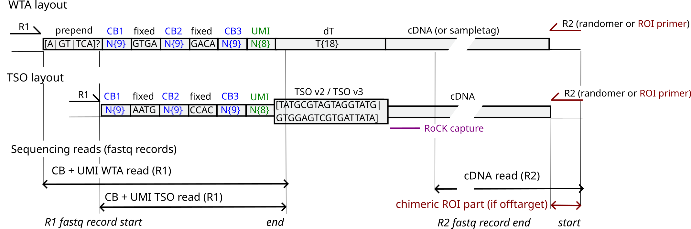

# Aim

Supplementary code for _RoCK and ROI: a single-cell RNA-sequencing method with enhanced transcriptome information via targeted enrichment of transcripts and preselected, region-specific sequencing_.

[Preprint](https://www.biorxiv.org/content/10.1101/2024.05.18.594120).

# Structure

- `00_mixing`: mouse + human cell mixing experiment, with GFP and tdTomato as captures. Aim: testing the RoCK and ROI library generation
- `01_pdgfra_experiment`: the mouse experiment with chr5 PDGFRA and GFP captures
- `03_first_mixing_experiment`: mouse + human cell mixing experiment, with GFP and tdTomato as captures. Aim: testing the addition of T primer during library generation
- `05_facs_plots`: analysis of FACS plots from RoCKseq bead modification
- `06_Sankey_plots`: code to generate Sankey plots for the two mixing experiments
- `07_leukemia_patient`: deprecated analysis of BCR-ABL patient data 
- `08_leukemia_cell_lines`: deprecated analysis of BCR-ABL cell line mixing experiment
- `10_troubleshooting`: artificially primed products (APP) documentation
- `10_HeLa_experiment`: HeLa low expression and multiplexing experiment
- `11_plots_revisions`: custom plotting addressing revision/reviewers concerns

# Other resources

- [main method](https://github.com/imallona/rock_roi_method)
- [deprecated repository](https://gitlab.uzh.ch/izaskun.mallona/ebrunner_spectral) or [mirror](https://github.com/imallona/ebrunner_spectral)
- [Chimeric reads debugging](https://github.com/imallona/rock_roi_debug) (perhaps private)

Plus several Zenado snapshots of these, including:

- [Method (zenodo)](https://zenodo.org/records/11070201)
- [this repository (zenodo)](https://zenodo.org/records/14881175)

# Sequencing reads layout TL/DR

  

# License

MIT

# Contact

- giulia.moro2 ta uzh.ch
- mark.robinson at mls.uzh.ch
- izaskun.mallona aa gmail dot com
